# Human-Computer Interaction (2022) - Hotel App

## Project Overview

This project is a team assignment for creating an electronic thematic hotel-park interface, designed for the "Human-Computer Interaction" course, offered in the 5th semester of the 2022 academic year at the University of Piraeus, Department of Informatics. The project involves the development of a user interface system for managing various aspects of the thematic park, including ancient-themed accommodations, pools, and interactive features.

## Course Information

- **Institution:** University of Piraeus
- **Department:** Department of Informatics
- **Course:** Human-Computer Interaction (2022)
- **Semester:** 4th

## Technologies Used

- Visual C#
- XAML
- Windows Presentation Foundation (WPF)

## Project Structure

### Modules

The project is organized into several modules, each responsible for different functionalities:

1. **Device Management:** Contains the interface and logic for managing devices in the ancient-themed rooms and the Trojan Horse RV.
2. **Pool Management:** Manages the controls and status updates for the central and private pools, including water levels and temperature.
3. **Trojan Horse RV Management:** Includes the interface for navigating and controlling the Trojan Horse RV, including door and ladder functionalities.
4. **Customer-Service Interaction:** Facilitates interactions between customers and staff, including ordering and billing processes.

### Interfaces

The user interfaces are designed for various functions:

- **Device Control Pages:** For managing electronic devices in rooms and RVs.
- **Pool Management Pages:** For monitoring and controlling pool functions.
- **Trojan Horse RV Control Pages:** For navigating and managing the RV.
- **Customer Service Pages:** For placing and managing orders with staff.

## Usage Examples

The interface for "The Palace of Zeus" allows interaction with several features of the thematic park. Here are some examples of how users can interact with the system:

### 1. Device Management
Users can control various devices within the ancient-themed rooms and Trojan Horse RV.

- **Controlling Lighting:** Users can turn lights on and off or adjust their brightness through the device control interface.

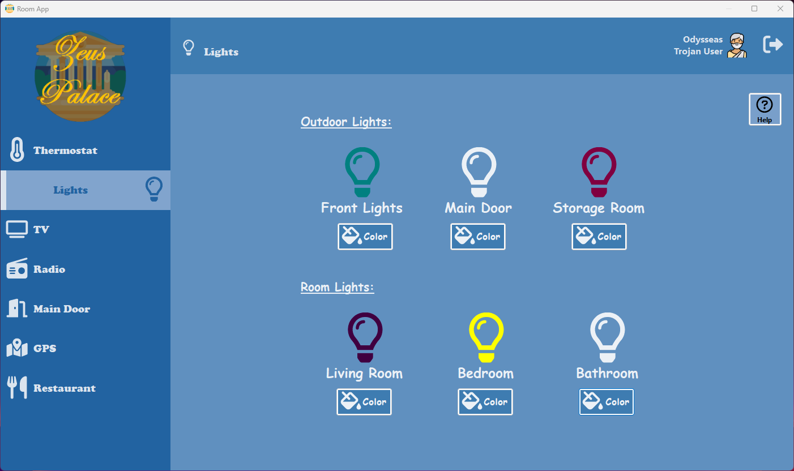

- **Adjusting Temperature:** Users can set heating or cooling preferences for their rooms or RV.

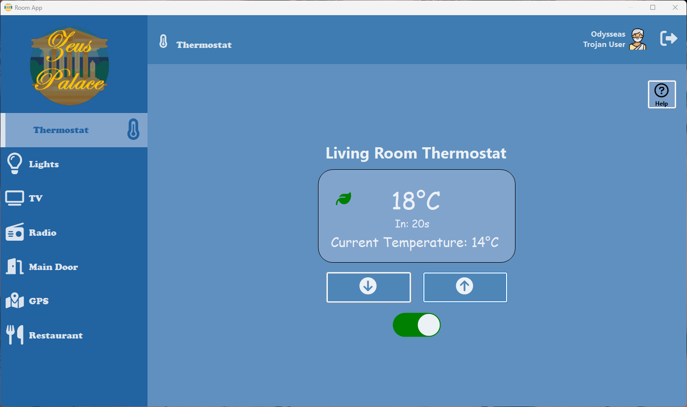

- **Managing Entertainment Systems:** Users can operate the TV or radio through the interface.

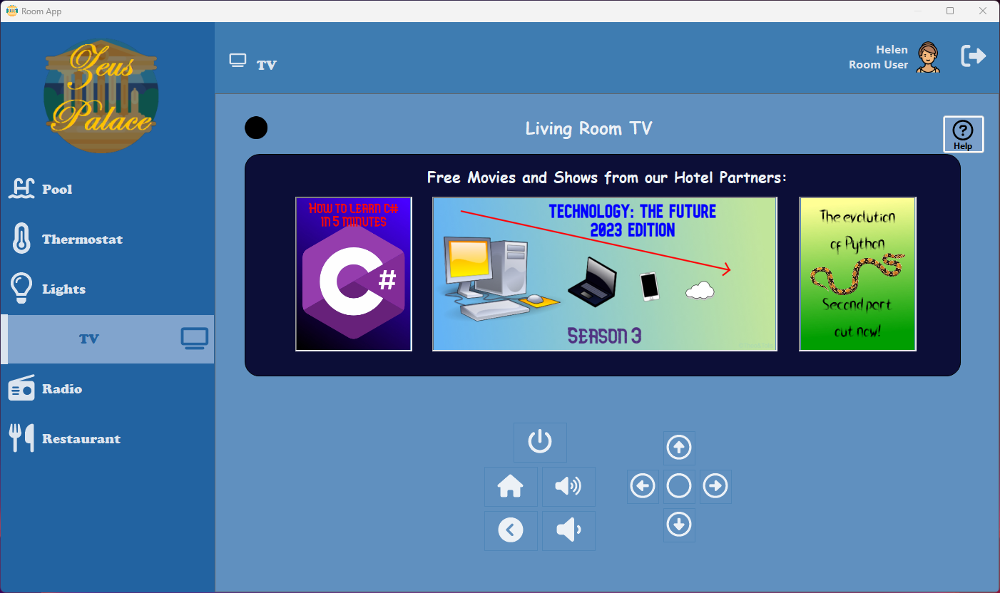
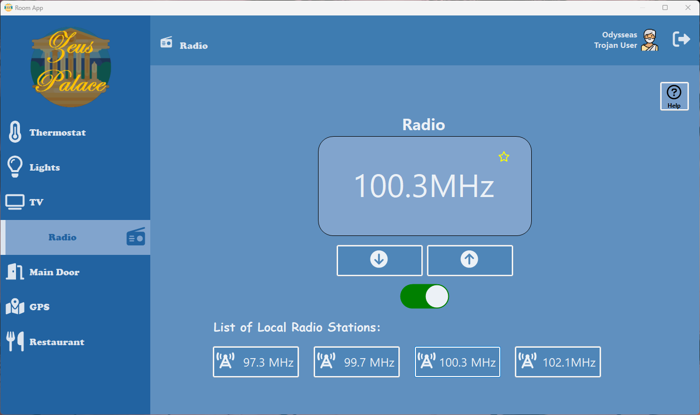

### 2. Pool Management
Users can monitor and manage the pools.

- **Adjusting Water Levels:** Users can fill or drain the pools through the management console.

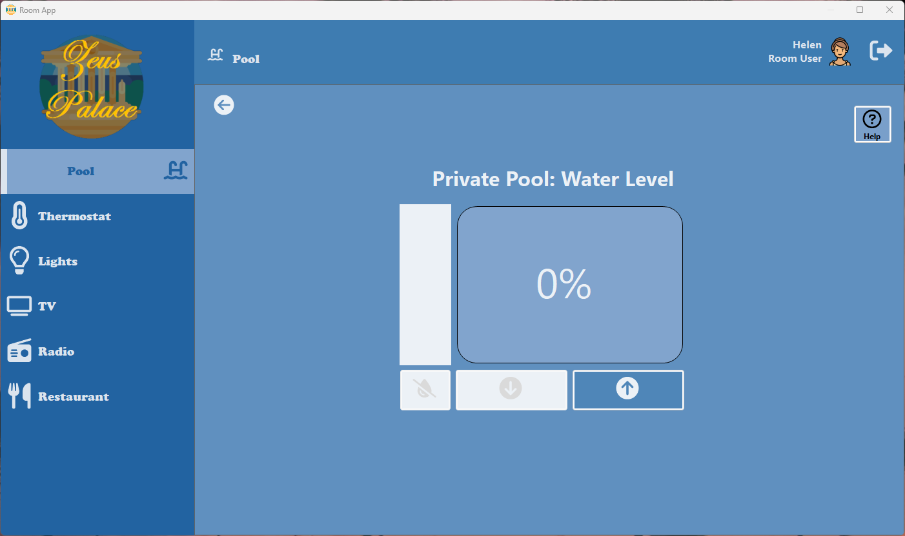

- **Controlling Water Temperature:** Users can set the desired temperature for the pools.

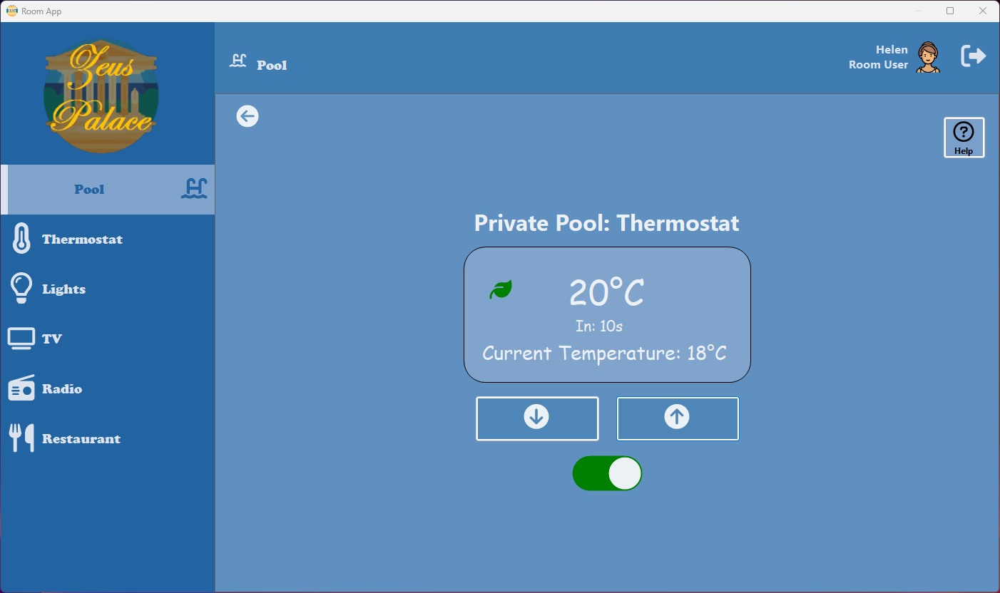

- **Activating Safety Sensors:** Users can activate or deactivate sensors and set alarms for safety.

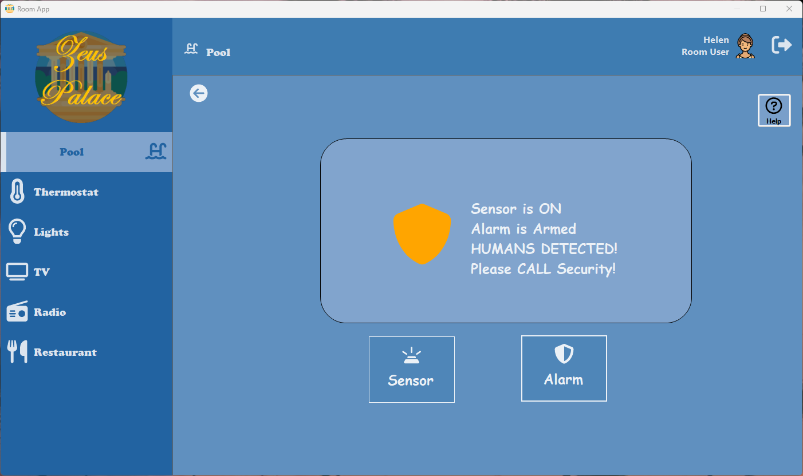

### 3. Trojan Horse RV Management
Users can navigate and control the Trojan Horse RV.

- **Navigating the RV:** Users can move the RV in various directions and park it within designated areas.

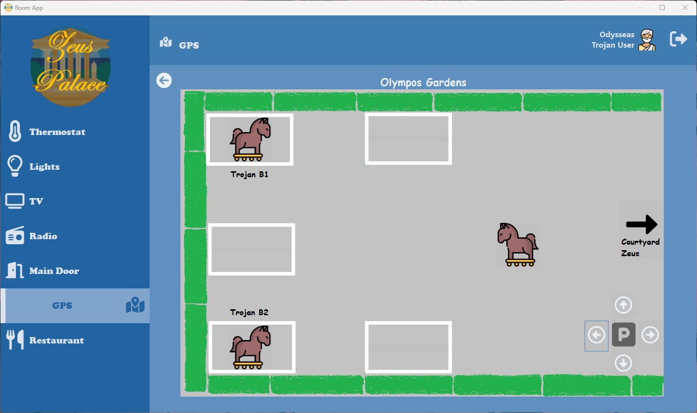

- **Controlling RV Doors and Ladder:** Users can open or close doors and manage the ladder functionality.

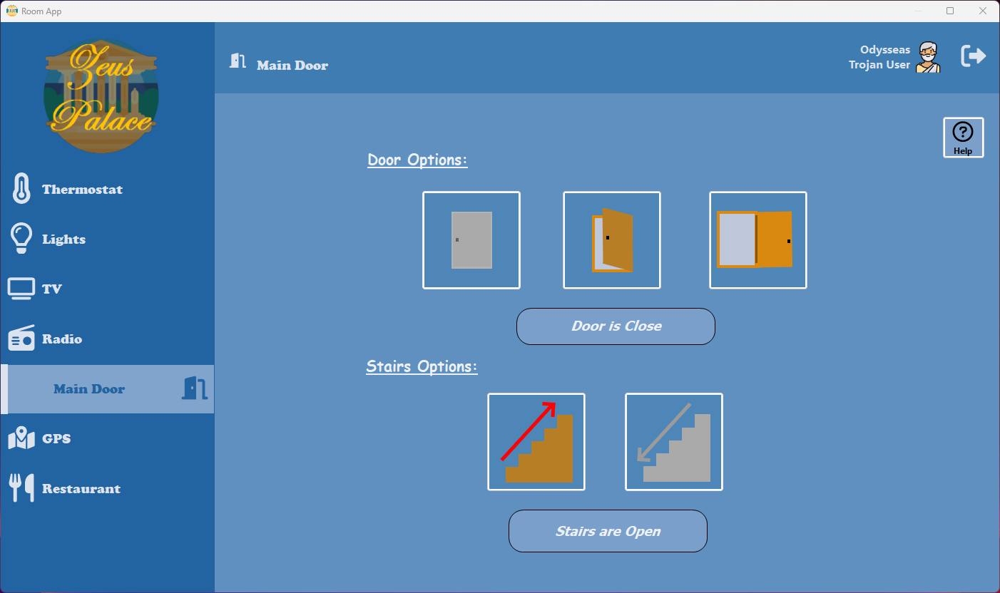

### 4. Customer-Service Interaction
Users can interact with staff to place and manage orders.

- **Placing Orders:** Customers can order food and beverages from the thematic restaurant.

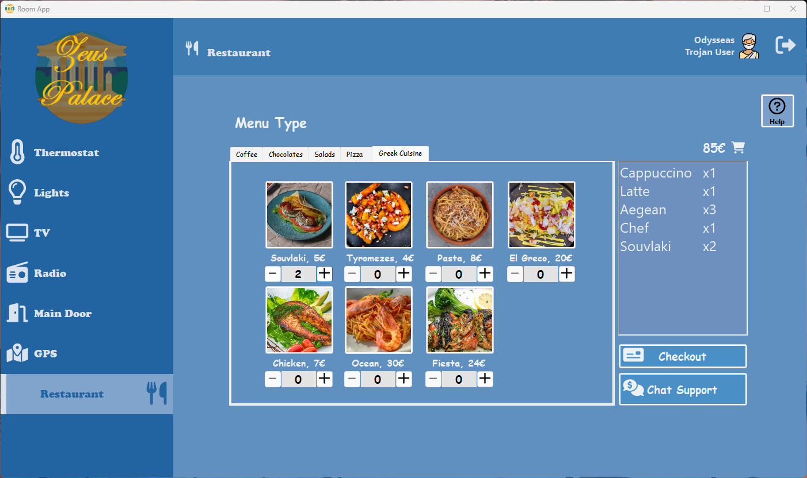

- **Viewing and Managing Orders:** Staff can process and manage customer orders.

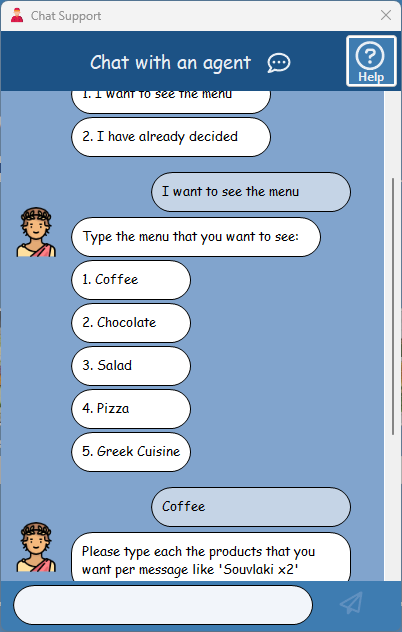

## Setup Instructions

1. Download and install **Visual Studio Enterprise 2022**.
2. Open the project in Visual Studio.
3. Build and run the application.
4. Ensure that the necessary dependencies are installed as specified in the project documentation.

## Contributors

<table>
  <tr>
    <td align="center"><a href="https://github.com/thkox"> <b>Theodoros Koxanoglou</b></a> </td>
    <td align="center"><a href="https://github.com/ApostolisSiampanis"> <b>Apostolis Siampanis</b></a> </td>
  </tr>
</table>

## License

This project is licensed under the MIT License - see the [LICENSE](./LICENSE) file for details.
